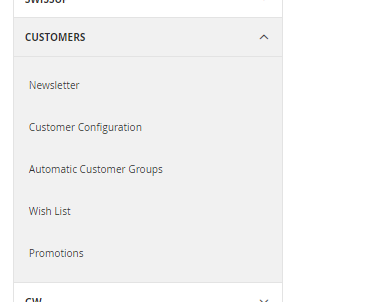
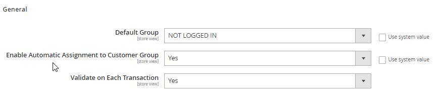

<h1>AutoCustomerGroup</h1>

Magento 2 Module - Auto Assign Customer Group based on Tax Scheme validation

Changes introduced to both the UK and EU VAT Tax systems require changes to be made to the Magento Tax system. These changes are required URGENTLY, and while Magento consider the changes required and work towards a permanent solution, this module can be used as an interim measure.

The module should be considered BETA. I encourage users to analyse the code, suggest improvements, generate PR's where applicable.

The module completely replaces the current Magento 2 VIV subsystem. The old settings are removed from the admin panel and replaced with a new Admin screen.

<h2>General</h2>

<ul>
<li><b>Default Group</b> - This is the default group that customers will be assigned to if they do not have a group assigned. Note that guest users are always assigned to the "NOT LOGGED IN" group.</li>
<li><b>Enable Automatic Assignment to Customer Group</b> - This activates and deactivates the module. When turned off, all orders will be placed either in the "NOT LOGGED IN" group for guests, or the Default Group/Customer Group for logged in customers.</li>
<li><b>Validate on Each Transaction</b> - If the order is being placed by a customer that has existing Tax ID Validation data stored in their shipping address, then this can be re-used on each subsequent order, or it can be revalidated every time.</li>
</ul>
