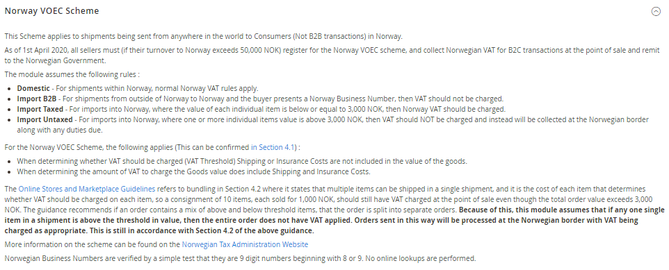

<h1>AutoCustomerGroup</h1>

Magento 2 Module - Auto Assign Customer Group based on Tax Scheme validation

<h2>Features</h2>
<ul>
<li>Operates on UK, EU, Norway VOEC, AU GST and NZ GST Schemes</li>
<li>Validation of Customers Tax ID on frontend during checkout, including feedback of validation status to customer.</li>
<li>Automatically change customer group during frontend orders based on order contents, Tax ID and Country.</li>
<li>Admin Create Customer - Tax ID's are validated and saved with the order address, but group change functionality disabled (only available while placing orders).</li>
<li>Admin Create Order - Tax ID's are validated using the "validate" link during order creation, and customer is assigned new group if applicable.</li>
<li>Option to add scheme currencies to Base Currency list for automatic exchange rate download, or able to use hard coded exchange rates.</li>
<li>Module can be disabled, where legacy Magento functionality is restored. Module can be enabled/disabled on a per store basis with legacy functionality on one store, and new functionality on another store.</li>
<li>Extends Tax Rate functionality to allow linking of Tax Rates to Tax Schemes</li>
<li>Includes Code to allow retieval of Order Tax Rates and linked Tax Schemes, for example when producing Invoice PDF's so the Tax Scheme details can be added to the PDF depending on which rates were used on the order. (example code below)</li>
<li>Records details of Tax Scheme used on orders to new table sales_order_tax_scheme.</li></ul>

<h2>Known Issues/Left to do</h2>
<ul>
<li>Need to test using logged in customers</li>
<li>Need more multi store/website testing with different currencies per store</li>
<li>Need to test enabling and disabling the module. Does legacy still work when disabled</li>
<li>Testing on frontend validation feedback</li>
</ul>

<h2>Overview</h2>

Changes introduced to both the UK and EU VAT Tax systems require changes to be made to the Magento Tax system. These changes are required URGENTLY, and while Magento consider the changes required and work towards a permanent solution, this module can be used as an interim measure.

The module should be considered BETA. I encourage users to analyse the code, suggest improvements, generate PR's where applicable.

Once customers have been placed in an appropriate group, tax rules can be configured to apply different taxes to each group, depending on what is required.

When enabled, this module replaces the existing Magento VIV functionality with a new, more extendable system. When the module is disabled, the existing Magento functionality is restored.

The module allows different base currencies to be used per website, if the price scope is set per website.

<h2>General</h2>

<ul>
<li><b>Enable Automatic Assignment to Customer Group</b> - This activates and deactivates the module. When turned off, orders will be processed using the existing Magento settings ane the existing VAT control is used on the frontend.</li>
<li><b>Validate on Each Transaction</b> - If the order is being placed by a customer that has existing Tax ID Validation data stored in their shipping address, then this can be re-used on each subsequent order, or it can be revalidated every time.</li>
<li><b>VAT/Tax Identifier Frontend Label</b> - The label for the VAT/Tax Id Input Box at Checkout.</li>
<li><b>Enable download of Additional Base Currencies</b> - Adds the Scheme Currencies (for enabled Schemes) to the list of Magento Base Currencies. This enables the downloading of the correct exchange rates for use in this module. This can be verified in Stores -> Currency Rates.</li>
</ul>
<h2>Frontend Validation Feedback</h2>

When enabled, this module replaces the frontend Form Element for the VAT/Tax ID Input box. If the currently selected Country has a Tax Scheme
associated with it, and the Tax Scheme enabled, and a valid format VAT/Tax Id is input on the frontend, then the Id is validated by the relevant
Tax Scheme and the results displayed to the customer. As soon as a country is selected that has a valid Tax Scheme associated with
it, the customer is presented with a prompt above the input field, notifying what they need to enter.

<h4>Valid Irish VAT Number</h4>

<h3>Correct format but not valid</h3>

<h3>Wrong Format</h3>

<h3>Valid UK VAT Numnber</h3>

<h2>UK VAT Scheme</h2>

<ul>
<li><b>Enabled</b> - Enable/Disable this Scheme.</li>
<li><b>Environment</b> - Whether to use the Sandbox or Production servers for the HMRC VAT Validation Service.</li>
<li><b>VAT Registration Number</b> - The UK VAT Registration Number for the Merchant. This will be provided to HMRC when all validation checks are made.</li>
<li><b>Import VAT Threshold</b> - If the order value is above the VAT Threshold, no VAT should be charged.</li>
<li><b>Use Magento Exchange Rate</b> - To convert from GBP Threshold to Store Currency Threshold, should we use the Magento Exchange Rate, or our own.</li>
<li><b>Exchange Rate</b> - The exchange rate to use to convert from GBP Threshold to Store Currency Threshold.</li>
<li><b>Customer Group - Domestic</b> - Merchant Country is within the UK/IM, Item is being shipped to the UK/IM.</li>
<li><b>Customer Group - Intra-EU B2B</b> - Merchant Country is within the EU, Item is being shipped to NI, Validated UK VAT Number Supplied.</li>
<li><b>Customer Group - Intra-EU B2C</b> - Merchant Country is within the EU, Item is being shipped to NI, Validated UK VAT Number is NOT Supplied.</li>
<li><b>Customer Group - Import B2B</b> - Merchant Country is not within the UK/IM, Item is being shipped to the UK/IM, Validated EU VAT Number Supplied.</li>
<li><b>Customer Group - Import Taxed</b> - Merchant Country is not within the UK/IM, Item is being shipped to the UKIM, Order Value is below or equal to Import VAT Threshold.</li>
<li><b>Customer Group - Import Untaxed</b> - Merchant Country is not within the UK/Isle of Man, Item is being shipped to the UK/Isle of Man, Order Value is above the Import VAT Threshold.</li>
</ul>

<h2>EU VAT Scheme</h2>

<ul>
<li><b>Enabled</b> - Enable/Disable this Scheme.</li>
<li><b>VAT Registration Country</b> - The country in which the Merchant is VAT Registered. This will be provided to VIES when all validation checks are made.</li>
<li><b>VAT Registration Number</b> - The EU VAT Registration Number for the Merchant. This will be provided to VIES when all validation checks are made.</li>
<li><b>Import VAT Threshold</b> - If the order value is above the VAT Threshold, no VAT should be charged.</li>
<li><b>Use Magento Exchange Rate</b> - To convert from EUR Threshold to Store Currency Threshold, should we use the Magento Exchange Rate, or our own.</li>
<li><b>Exchange Rate</b> - The exchange rate to use to convert from EUR Threshold to Store Currency Threshold.</li>
<li><b>Customer Group - Domestic</b> - Merchant Country is within the EU, Item is being shipped to the same country.</li>
<li><b>Customer Group - Intra-EU B2B</b> - Merchant Country is within the EU or NI, Item is being shipped to the EU, Merchant Country and Shipping Country are not the same, Validated EU VAT Number Supplied.</li>
<li><b>Customer Group - Intra-EU B2C</b> - Merchant Country is within the EU or NI, Item is being shipped to the EU, Merchant Country and Shipping Country are not the same, Validated EU VAT Number is NOT Supplied.</li>
<li><b>Customer Group - Import B2B</b> - Merchant Country is not within the EU, Item is being shipped to the EU, Validated EU VAT Number Supplied.</li>
<li><b>Customer Group - Import Taxed</b> - Merchant Country is not within the EU, Item is being shipped to the EU, Order Value is below or equal to the Import VAT Threshold.</li>
<li><b>Customer Group - Import Untaxed</b> - Merchant Country is not within the EU, Item is being shipped to the EU, Order Value is above the Import VAT Threshold.</li>
</ul>

<h2>Norway VOEC Scheme</h2>

<ul>
<li><b>Enabled</b> - Enable/Disable this Scheme.</li>
<li><b>VOEC Registration Number</b> - The Norway VOEC Registration Number for the Merchant. This is not currently used by the module.</li>
<li><b>Import VAT Threshold</b> - If any single item within the order is valued above the VAT threshold then no VAT should be charged.</li>
<li><b>Use Magento Exchange Rate</b> - To convert from NOK Threshold to Store Currency Threshold, should we use the Magento Exchange Rate, or our own.</li>
<li><b>Exchange Rate</b> - The exchange rate to use to convert from NOK Threshold to Store Currency Threshold.</li>
<li><b>Customer Group - Domestic</b> - Merchant Country is within Norway, Item is being shipped to Norway.</li>
<li><b>Customer Group - Import B2B</b> - Merchant Country is not within Norway, Item is being shipped to Norway, Norwegian Business Number Supplied.</li>
<li><b>Customer Group - Import Taxed</b> - Merchant Country is not within Norway, Item is being shipped to Norway, All items valued at or below the Import VAT Threshold.</li>
<li><b>Customer Group - Import Untaxed</b> - Merchant Country is not within Norway, Item is being shipped to Norway, One or more items in the order is valued above the Import VAT Threshold.</li>
</ul>

<h2>Australia GST for Non Residents Scheme</h2>

<ul>
<li><b>Enabled</b> - Enable/Disable this Scheme.</li>
<li><b>ABN API GUID</b> - The GUID provided by the Australian Business Register website for API access.</li>
<li><b>ATO Registration Number</b> - The ATO Registration Number for the Merchant. This is not currently used by the module.</li>
<li><b>Import GST Threshold</b> - If the order value is above the GST Threshold, no GST should be charged.</li>
<li><b>Use Magento Exchange Rate</b> - To convert from AUD Threshold to Store Currency Threshold, should we use the Magento Exchange Rate, or our own.</li>
<li><b>Exchange Rate</b> - The exchange rate to use to convert from AUD Threshold to Store Currency Threshold.</li>
<li><b>Customer Group - Domestic</b> - Merchant Country is within Australia, Item is being shipped to Australia.</li>
<li><b>Customer Group - Import B2B</b> - Merchant Country is not within Australia, Item is being shipped to Australia, GST Validated ABN Number Supplied.</li>
<li><b>Customer Group - Import Taxed</b> - Merchant Country is not within Australia, Item is being shipped to Australia, Order Value is below or equal to the Import GST Threshold.</li>
<li><b>Customer Group - Import Untaxed</b> - Merchant Country is not within Australia, Item is being shipped to Australia, Order Value is above the Import GST Threshold.</li>
</ul>

<h2>New Zealand GST Scheme</h2>

<ul>
<li><b>Enabled</b> - Enable/Disable this Scheme.</li>
<li><b>GST Registration Number</b> - The GST Registration Number for the Merchant. This is not currently used by the module.</li>
<li><b>Import GST Threshold</b> - If the order value is above the GST Threshold, no GST should be charged.</li>
<li><b>Use Magento Exchange Rate</b> - To convert from NZD Threshold to Store Currency Threshold, should we use the Magento Exchange Rate, or our own.</li>
<li><b>Exchange Rate</b> - The exchange rate to use to convert from NZD Threshold to Store Currency Threshold.</li>
<li><b>Customer Group - Domestic</b> - Merchant Country is within New Zealand, Item is being shipped to New Zealand.</li>
<li><b>Customer Group - Import B2B</b> - Merchant Country is not within New Zealand, Item is being shipped to New Zealand, GST Number Supplied.</li>
<li><b>Customer Group - Import Taxed</b> - Merchant Country is not within New Zealand, Item is being shipped to New Zealand, All items valued at or below the Import GST Threshold.</li>
<li><b>Customer Group - Import Untaxed</b> - Merchant Country is not within New Zealand, Item is being shipped to New Zealand, One or more items in the order is valued above the Import GST Threshold.</li>
</ul>

<h2>Tax Rate to Tax Scheme Links</h2>

The module allows you to link each tax rate to a particular tax scheme. In post order functions, this allows you to query this module using order details, and obtain the list of tax rates applicable to the order, and return the TAX Scheme Registration Numbers linked to the order. This is useful
when generating invoices for example.

The links can be set under the existing Tax Zones and Rates Screens

<h2>Getting Information on Tax Schemes used on Order</h2>

This module stores additional information into the sales_order_tax_scheme table whenever
an order is placed that triggered a tax rule linked to a Tax Scheme.

This information can be easily accessed so that information on which tax schemes were
used on an order, can be included on the Invoice PDF's for example.

The following code shows how this can be achieved.

<pre>
<code>
    
    use Gw\AutoCustomerGroup\Model\ResourceModel\OrderTaxScheme\CollectionFactory;
    use Magento\Directory\Model\CurrencyFactory;

    /**
     * @var CollectionFactory
     */
    private $orderTaxSchemeCollectionFactory;

    /**
     * @var CurrencyFactory
     */
    public $currencyFactory;
    ...
    ...
    ...

    $orderTaxSchemes = $this->orderTaxSchemeCollectionFactory->create()->loadByOrder($order);
    foreach ($orderTaxSchemes as $taxScheme) {
        $storeCurrency = $this->currencyFactory->create()->load($taxScheme->getStoreCurrency());
        $schemeCurrency = $this->currencyFactory->create()->load($taxScheme->getSchemeCurrency());
        $baseCurrency = $this->currencyFactory->create()->load($taxScheme->getBaseCurrency());

        output("TAX Summary - " . $taxScheme->getName());

        tableheading("Registration Number");
        tableheading("Currency");
        tableheading("Exchange Rate");
        tableheading("TAX Rate");
        tableheading("Taxable Total");
        tableheading("TAX");

        //Store Currency
        cell($taxScheme->getReference());
        cell($taxScheme->getStoreCurrency());
        cell("");
        cell(round($taxScheme->getRate(), 2) . "%");
        cell($storeCurrency->formatTxt($taxScheme->getTaxableAmountStore(), ['precision' => 2]));
        cell($storeCurrency->formatTxt($taxScheme->getTaxAmountStore(), ['precision' => 2]));

        //Base Currency
        if ($taxScheme->getStoreBaseCurrency() != $taxScheme->getStoreCurrency())
        {
            $exchangerate = $taxScheme->getExchangeRateStoreToStoreBase();
            cell("");
            cell($taxScheme->getStoreBaseCurrency());
            cell($taxScheme->getStoreBaseCurrency() . " > " . $taxScheme->getStoreCurrency() . " = " . $exchangerate);
            cell(round($taxScheme->getRate(), 2) . "%");
            cell($storeCurrency->formatTxt($taxScheme->getTaxableAmountStoreBase(), ['precision' => 2]));
            cell($storeCurrency->formatTxt($taxScheme->getTaxAmountStoreBase(), ['precision' => 2]));
        }

        //Scheme Currency
        if ($taxScheme->getSchemeCurrency() != $taxScheme->getStoreCurrency())
        {
            $exchangerate = $taxScheme->getExchangeRateStoreToStoreBase() *
                    $taxScheme->getExchangeRateStoreBaseToScheme();
            cell("");
            cell($taxScheme->getSchemeCurrency());
            cell($taxScheme->getSchemeCurrency() . " > " . $taxScheme->getStoreCurrency() . " = " . $exchangerate);
            cell(round($taxScheme->getRate(), 2) . "%");
            cell($storeCurrency->formatTxt($taxScheme->getTaxableAmountScheme(), ['precision' => 2]));
            cell($storeCurrency->formatTxt($taxScheme->getTaxAmountScheme(), ['precision' => 2]));
        }
</code>
</pre>

This will produce output similar to the following

<ul>
<li>Scheme Currency is the same as Store currency. </li>
<li>Scheme Currency is different to Store currency. </li>
</ul>
<h2>Integration Tests</h2>

To run the integration tests, you need your own credentials for the Australian ID Checker services. Please
add them to config-global.php. The tests for UK (Sandbox), EU and Australia use the live API's

<ul>
<li>autocustomergroup/australiagst/apiguid'</li>
</ul>
