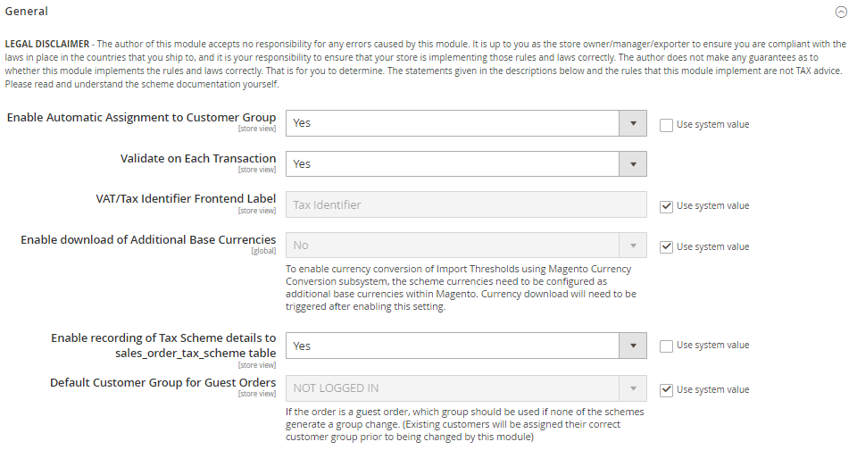
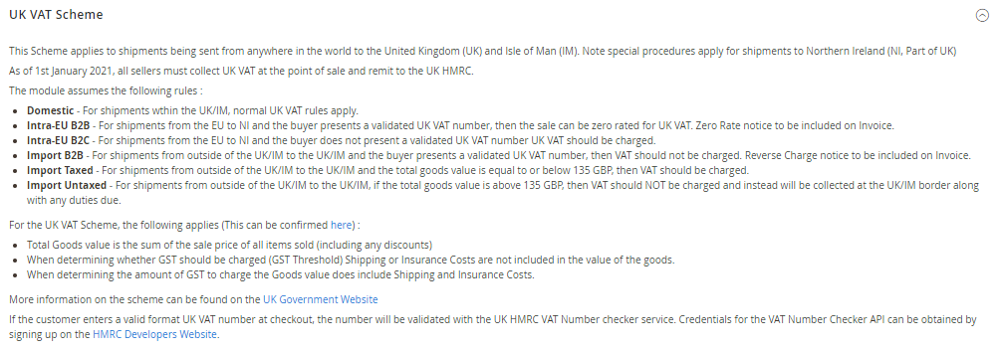
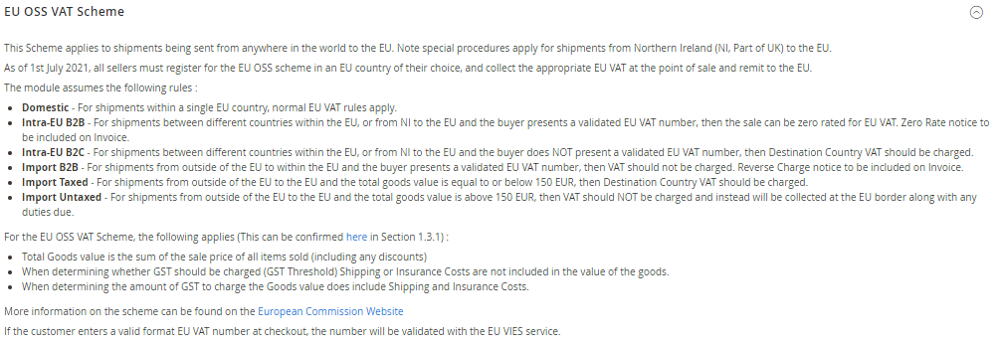
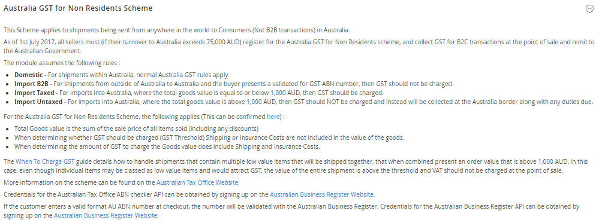
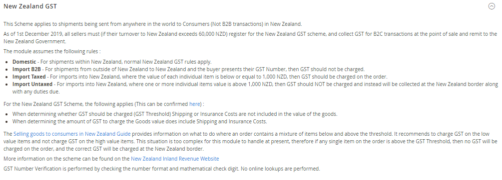

<h1>AutoCustomerGroup</h1>

Magento 2 Module - Auto Assign Customer Group based on Tax Scheme validation

<h2>Overview</h2>

Changes introduced to both the UK and EU VAT Tax systems require changes to be made to the Magento Tax system. These changes are required URGENTLY, and while Magento consider the changes required and work towards a permanent solution, this module can be used as an interim measure.

The module should be considered BETA. I encourage users to analyse the code, suggest improvements, generate PR's where applicable.

Once customers have been placed in an appropriate group, tax rules can be configured to apply different taxes to each group, depending on what is required.

The module completely replaces the current Magento 2 VIV subsystem. The old settings are removed from the admin panel and replaced with a new Admin screen.

<h2>General</h2>

<ul>
<li><b>Default Group</b> - This is the default group that customers will be assigned to if they do not have a group assigned. Note that guest users are always assigned to the "NOT LOGGED IN" group.</li>
<li><b>Enable Automatic Assignment to Customer Group</b> - This activates and deactivates the module. When turned off, all orders will be placed either in the "NOT LOGGED IN" group for guests, or the Default Group/Customer Group for logged in customers.</li>
<li><b>Validate on Each Transaction</b> - If the order is being placed by a customer that has existing Tax ID Validation data stored in their shipping address, then this can be re-used on each subsequent order, or it can be revalidated every time.</li>
</ul>
<h2>UK VAT Scheme</h2>

<ul>
<li><b>Enabled</b> - Enable/Disable this Scheme.</li>
<li><b>Environment</b> - Whether to use the Sandbox or Production servers for the HMRC VAT Validation Service.</li>
<li><b>Client ID</b> - Client ID as provided by HMRC Developer Portal.</li>
<li><b>Client Secret</b> - Client Secret as provided by HMRC Developer Portal.</li>
<li><b>VAT Registration Number</b> - The UK VAT Registration Number for the Merchant. This will be provided to HMRC when all validation checks are made.</li>
<li><b>Import VAT Threshold</b> - If the order value is above the VAT Threshold, no VAT should be charged.</li>
<li><b>Customer Group - Domestic</b> - Merchant Country is within the UK/IM, Item is being shipped to the UK/IM.</li>
<li><b>Customer Group - Intra-EU B2B</b> - Merchant Country is within the EU, Item is being shipped to NI, Validated UK VAT Number Supplied.</li>
<li><b>Customer Group - Intra-EU B2C</b> - Merchant Country is within the EU, Item is being shipped to NI, Validated UK VAT Number is NOT Supplied.</li>
<li><b>Customer Group - Import B2B</b> - Merchant Country is not within the UK/IM, Item is being shipped to the UK/IM, Validated EU VAT Number Supplied.</li>
<li><b>Customer Group - Import Taxed</b> - Merchant Country is not within the UK/IM, Item is being shipped to the UKIM, Order Value is below or equal to Import VAT Threshold.</li>
<li><b>Customer Group - Import Untaxed</b> - Merchant Country is not within the UK/Isle of Man, Item is being shipped to the UK/Isle of Man, Order Value is above the Import VAT Threshold.</li>
</ul>

<h2>EU VAT Scheme</h2>

<ul>
<li><b>Enabled</b> - Enable/Disable this Scheme.</li>
<li><b>VAT Registration Country</b> - The country in which the Merchant is VAT Registered. This will be provided to VIES when all validation checks are made.</li>
<li><b>VAT Registration Number</b> - The EU VAT Registration Number for the Merchant. This will be provided to VIES when all validation checks are made.</li>
<li><b>Import VAT Threshold</b> - If the order value is above the VAT Threshold, no VAT should be charged.</li>
<li><b>Customer Group - Domestic</b> - Merchant Country is within the EU, Item is being shipped to the same country.</li>
<li><b>Customer Group - Intra-EU B2B</b> - Merchant Country is within the EU or NI, Item is being shipped to the EU, Merchant Country and Shipping Country are not the same, Validated EU VAT Number Supplied.</li>
<li><b>Customer Group - Intra-EU B2C</b> - Merchant Country is within the EU or NI, Item is being shipped to the EU, Merchant Country and Shipping Country are not the same, Validated EU VAT Number is NOT Supplied.</li>
<li><b>Customer Group - Import B2B</b> - Merchant Country is not within the EU, Item is being shipped to the EU, Validated EU VAT Number Supplied.</li>
<li><b>Customer Group - Import Taxed</b> - Merchant Country is not within the EU, Item is being shipped to the EU, Order Value is below or equal to the Import VAT Threshold.</li>
<li><b>Customer Group - Import Untaxed</b> - Merchant Country is not within the EU, Item is being shipped to the EU, Order Value is above the Import VAT Threshold.</li>
</ul>

<h2>Norway VOEC Scheme</h2>

<ul>
<li><b>Enabled</b> - Enable/Disable this Scheme.</li>
<li><b>VOEC Registration Number</b> - The Norway VOEC Registration Number for the Merchant. This is not currently used by the module.</li>
<li><b>Import VAT Threshold</b> - If any single item within the order is valued above the VAT threshold then no VAT should be charged.</li>
<li><b>Customer Group - Domestic</b> - Merchant Country is within Norway, Item is being shipped to Norway.</li>
<li><b>Customer Group - Import B2B</b> - Merchant Country is not within Norway, Item is being shipped to Norway, Norwegian Business Number Supplied.</li>
<li><b>Customer Group - Import Taxed</b> - Merchant Country is not within Norway, Item is being shipped to Norway, All items valued at or below the Import VAT Threshold.</li>
<li><b>Customer Group - Import Untaxed</b> - Merchant Country is not within Norway, Item is being shipped to Norway, One or more items in the order is valued above the Import VAT Threshold.</li>
</ul>

<h2>Australia GST for Non Residents Scheme</h2>

<ul>
<li><b>Enabled</b> - Enable/Disable this Scheme.</li>
<li><b>ABN API GUID</b> - The GUID provided by the Australian Business Register website for API access.</li>
<li><b>ATO Registration Number</b> - The ATO Registration Number for the Merchant. This is not currently used by the module.</li>
<li><b>Import GST Threshold</b> - If the order value is above the GST Threshold, no GST should be charged.</li>
<li><b>Customer Group - Domestic</b> - Merchant Country is within Australia, Item is being shipped to Australia.</li>
<li><b>Customer Group - Import B2B</b> - Merchant Country is not within Australia, Item is being shipped to Australia, GST Validated ABN Number Supplied.</li>
<li><b>Customer Group - Import Taxed</b> - Merchant Country is not within Australia, Item is being shipped to Australia, Order Value is below or equal to the Import GST Threshold.</li>
<li><b>Customer Group - Import Untaxed</b> - Merchant Country is not within Australia, Item is being shipped to Australia, Order Value is above the Import GST Threshold.</li>
</ul>

<h2>New Zealand GST Scheme</h2>

<ul>
<li><b>Enabled</b> - Enable/Disable this Scheme.</li>
<li><b>GST Registration Number</b> - The GST Registration Number for the Merchant. This is not currently used by the module.</li>
<li><b>Import GST Threshold</b> - If the order value is above the GST Threshold, no GST should be charged.</li>
<li><b>Customer Group - Domestic</b> - Merchant Country is within New Zealand, Item is being shipped to New Zealand.</li>
<li><b>Customer Group - Import B2B</b> - Merchant Country is not within New Zealand, Item is being shipped to New Zealand, GST Number Supplied.</li>
<li><b>Customer Group - Import Taxed</b> - Merchant Country is not within New Zealand, Item is being shipped to New Zealand, All items valued at or below the Import GST Threshold.</li>
<li><b>Customer Group - Import Untaxed</b> - Merchant Country is not within New Zealand, Item is being shipped to New Zealand, One or more items in the order is valued above the Import GST Threshold.</li>
</ul>
<h2>Integration Tests</h2>

To run the inmtegration tests, you need your own credentials for the UK Sandbox and Australian ID Checker services. Please
add them to config-global.php. The tests for UK (Sandbox), EU and Australia use the live API's

<ul>
<li>autocustomergroup/ukvat/clientid'</li>
<li>autocustomergroup/ukvat/clientsecret'</li>
<li>autocustomergroup/australiagst/apiguid'</li>
</ul>
<h2>Known Issues</h2>
<ul>
<li>I havent done any testing on creating customers in the admin, or validating VAT numbers in admin. This will need looking at, at some point.</li>
<li>Currently, VAT thresholds need to be calculated from the values stated in law, and converted manually into store currency. Future update will
 look into what can be done with this.</li>
<li>What can be done where orders are split into multiple shipments, individually below the threshold, but the order is above the threshold.</li>
<li>All testing sofar is done using Guest Orders. No Logged in orders have been tested.</li>
</ul>
