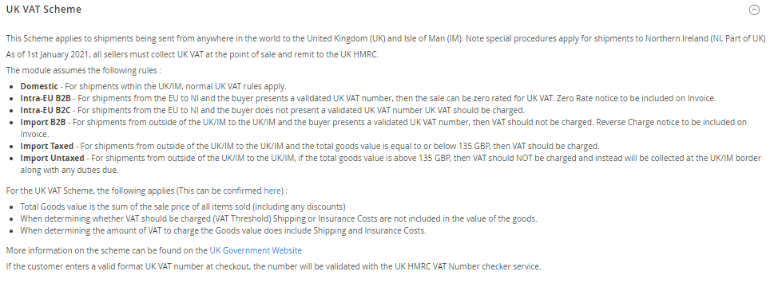

<h1>AutoCustomerGroup</h1>

Magento 2 Module - Auto Assign Customer Group based on Tax Scheme validation

<h2>Overview</h2>

Changes introduced to both the UK and EU VAT Tax systems require changes to be made to the Magento Tax system. These changes are required URGENTLY, and while Magento consider the changes required and work towards a permanent solution, this module can be used as an interim measure.

The module should be considered BETA. I encourage users to analyse the code, suggest improvements, generate PR's where applicable.

Once customers have been placed in an appropriate group, tax rules can be configured to apply different taxes to each group, depending on what is required.

The module completely replaces the current Magento 2 VIV subsystem. The old settings are removed from the admin panel and replaced with a new Admin screen.

<h2>General</h2>

<ul>
<li><b>Default Group</b> - This is the default group that customers will be assigned to if they do not have a group assigned. Note that guest users are always assigned to the "NOT LOGGED IN" group.</li>
<li><b>Enable Automatic Assignment to Customer Group</b> - This activates and deactivates the module. When turned off, all orders will be placed either in the "NOT LOGGED IN" group for guests, or the Default Group/Customer Group for logged in customers.</li>
<li><b>Validate on Each Transaction</b> - If the order is being placed by a customer that has existing Tax ID Validation data stored in their shipping address, then this can be re-used on each subsequent order, or it can be revalidated every time.</li>
</ul>
<h2>UK VAT Scheme</h2>

<ul>
<li><b>Enabled</b> - Enable/Disable this Scheme.</li>
<li><b>Environment</b> - Whether to use the Sandbox or Production servers for the HMRC VAT Validation Service.</li>
<li><b>Client ID</b> - Client ID as provided by HMRC Developer Portal.</li>
<li><b>Client Secret</b> - Client Secret as provided by HMRC Developer Portal.</li>
<li><b>VAT Registration Number</b> - The UK VAT Registration Number for the Merchant. This will be provided to HMRC when all validation checks are made.</li>
<li><b>Import VAT Threshold</b> - The order value (ex VAT) threshold (in Store Currency) above which no VAT should be charged. Calculated as the sum of all line items after discount ex Tax.</li>
<li><b>Customer Group - Import Zero</b> - Merchant Country is not within the UK/Isle of Man, Item is being shipped to the UK/Isle of Man, VAT Number Validated Successfully.</li>
<li><b>Customer Group - Import Untaxed</b> - Merchant Country is not within the UK/Isle of Man, Item is being shipped to the UK/Isle of Man, Order Value is above Tax Threshold.</li>
</ul>

<h2>EU VAT Scheme</h2>

<ul>
<li><b>Enabled</b> - Enable/Disable this Scheme.</li>
<li><b>VAT Registration Country</b> - The country in which the Merchant is VAT Registered. This will be provided to HMRC when all validation checks are made.</li>
  <li><b>VAT Registration Number</b> - The EU VAT Registration Number for the Merchant. This will be provided to HMRC when all validation checks are made.</li>
<li><b>Import VAT Threshold</b> - The order value (ex VAT) threshold (in Store Currency) above which no VAT should be charged. Calculated as the sum of all line items after discount ex Tax.</li>
<li><b>Customer Group - Intra-EU Zero</b> - Merchant Country is within the EU, Item is being shipped to the EU, Merchant Country and Shipping Country are not the same, VAT Number Validated Successfully.</li>
<li><b>Customer Group - Import Zero</b> - Merchant Country is not within the EU, Item is being shipped to the EU, VAT Number Validated Successfully.</li>
<li><b>Customer Group - Import Untaxed</b> - Merchant Country is not within the EU, Item is being shipped to the EU, Order Value is above Tax Threshold.</li>

</ul>

<h2>Known Issues</h2>
<ul>
<li>I havent done any testing on creating customers in the admin, or validating VAT numbers in admin. This will need looking at, at some point.</li>
<li>Is it acceptable to use local currency. The law is 135GBP or 150EUR, but we would need currency conversion setting up for this to automatically convert from local to GBP/EUR. The law defines which currency rates you can use when converting the thresholds. Need to look into this.</li>
<li>Need to consider the merchant is in NI and sending to the EU. Also when merchant is in EU and sending to NI.</li>
<li>What can be done where orders are split into multiple shipments, individually below the threshold, but the order is above the threshold.</li>
</ul>
